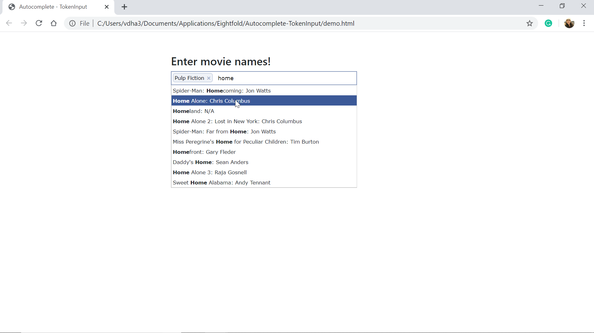

Autocomplete TokenInput: A Tokenizing Autocomplete Text Entry
=======================================================

Overview
--------
- Tokeninput is a jQuery plugin that allows the user to search and enter movie names.
- This works for the OMDB API: http://www.omdbapi.com/
- This feature allows the user to search for a movie by its title, and provides suggestions closest to the entered characters, listing the movie title along with the director.
- The selected movie gets loaded in the search bar as a token (or pill), with a delete (x) option
- No more than 5 selections can be made at a time
- The autocomplete dropdown disappears when clicked outside of the box

Dependencies
------------
The following libraries are used
- jquery 3.4.1 (works with jquery 1.5.1 or higher)
- Bootstrap 4.4.1

Reference
---------
- Project used for reference: https://loopj.com/jquery-tokeninput/
- Reference for nested query implementation: https://stackoverflow.com/a/32540936

To execute
----------
- Download this repository/folder (Autocomplete-TokenInput)
- Open demo.html in a web browser
- You'll know what to do!

Demo
------

